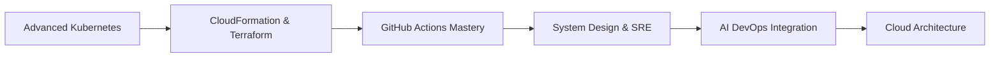

  
# 👋 Welcome to My Digital Universe!

FROM: AADI.png
TO: 

---

## 💼 About Me

I'm a passionate **DevOps professional** with a solid foundation in server management, deployment automation, and infrastructure optimization. Currently working with **Tata Consultancy Services (TCS)**, I specialize in streamlining CI/CD pipelines, resolving server issues, and managing end-to-end release processes.

### 🚀 **What I Do:**
- 🔧 Expert in **Git, Jenkins, Ansible, Docker, Kubernetes**
- ☁️ Cloud technologies **AWS**, Infrastructure as Code (IaC)
- 💻 Scripting master in **Python, Shell**, and **SQL**
- 🛠️ Automation workflow optimization specialist
- 🏆 **Achieved 30% reduction** in deployment release time via CI/CD pipeline optimization
- 🤖 **AI Technology Explorer** - Leveraging AI in DevOps and Banking projects

---

## 🛠️ Tech Stack & Skills

### **Languages & Technologies**

### **DevOps & Cloud**

### **AI & Emerging Technologies**

---

## 🎓 Growth School - AI Technology Workshop

### 🚀 **Recently Completed: 3-Day AI Technology Intensive Workshop**

I recently participated in an intensive **3-day Growth School workshop** focused on **AI Technologies and their transformative applications** in today's rapidly evolving digital landscape.

#### **🎯 Key Learning Areas:**

- 🤖 **AI Technologies Overview** - Understanding various AI applications and their impact on modern business
- ✨ **Advanced Prompt Engineering** - Crafting effective prompts for maximum AI output efficiency
- 🌐 **AI-Powered Website Development** - Leveraging AI tools for rapid web development
- 📊 **Excel Automation with AI** - Streamlining data analysis and reporting processes
- 🎨 **AI-Enhanced Presentations** - Creating compelling PowerPoint presentations using AI assistance
- 🎥 **AI Video Creation** - Exploring tools for automated video content generation
- 🧠 **Generative AI Applications** - Practical implementations in various business scenarios
- 🔧 **Agentic AI Systems** - Understanding autonomous AI agents and their applications

#### **💼 Real-World Application:**
I'm actively implementing these **AI technologies in my current banking project at TCS**, focusing on:
- Automated testing and deployment processes
- Intelligent monitoring and alerting systems  
- AI-powered documentation and reporting
- Enhanced customer experience through AI integration

> 💡 **"The future belongs to those who understand how to harmoniously blend human creativity with AI capabilities"**

---

## 🚀 Professional Experience

### **Deployment Engineer** | **Tata Consultancy Services (TCS)**  
📍 **Gurugram** | 🗓️ **Feb 2022 – Present**

#### **🎯 Key Responsibilities & Achievements:**
- 🏗️ **Infrastructure as Code (IaC)** implementation for reliable and repeatable deployments
- ⚙️ **Jenkins CI/CD Pipeline Optimization** - Reduced manual steps and improved efficiency by **30%**
- 🔄 **Zero-Downtime Production Releases** using advanced automation techniques
- 🐛 **Critical Issue Resolution** - Rapid response to client feedback and live environment challenges
- 🌟 **24/7 Team Support** - Ensuring system stability and continuous delivery excellence
- 🤖 **AI Integration** - Currently implementing AI technologies in banking project workflows

#### **💼 Current Project Focus:**
Working on a **live banking project** where I'm integrating **AI technologies** learned from Growth School to enhance:
- Automated deployment processes
- Intelligent system monitoring
- AI-powered documentation generation
- Enhanced security protocols

---

## 📈 GitHub Statistics

---

## 📜 Featured Projects

### 🧠 **Robust Visual Analysis of Eye State** - *AI-Powered Safety Solution*

**🎯 Project Overview:**
- **Built a Python-based AI device** to detect driver drowsiness using advanced **eye-tracking algorithms**
- **Mission:** Reduce nighttime road accidents through real-time alertness monitoring
- **Testing:** Successfully deployed in real-world scenarios with actual drivers
- **Feedback Loop:** Implemented continuous improvement system based on user feedback

**💡 Technologies Used:** Python, Computer Vision, Machine Learning, OpenCV, TensorFlow

**🏆 Impact:** Demonstrated potential to significantly reduce road accidents caused by driver fatigue

---

### 🏦 **Banking Project AI Integration** - *Current Work at TCS*
**🎯 Project Focus:**
- Integrating **AI technologies** learned from Growth School into live banking systems
- **Automated Testing & Deployment** using AI-powered tools
- **Intelligent Monitoring Systems** with predictive analytics
- **AI-Enhanced Documentation** for better project management

**💡 Technologies:** Jenkins, Docker, Kubernetes, Python, AI/ML APIs, Banking Systems Integration

---

## 🏅 Achievements & Recognition

### **🏆 Professional Awards**
| Award | Organization | Recognition For |
|-------|-------------|----------------|
| **On The Spot Award #2** | TCS | Providing exceptional 24/7 team support |
| **Service Commitment Award** | TCS | Years of seamless contribution to organization |
| **Growth School AI Certificate** | Growth School | Completing 3-day AI Technology Workshop |

---

## 📚 Certifications & Learning Journey

### **🎓 Professional Certifications**

#### **🔹 Technical Certifications:**
- **GitHub Essential Training** – LinkedIn Learning
- **SQL Programming Mastery** – LinkedIn Learning  
- **Infrastructure as Code (IaC)** – TCS Internal Certification
- **Generative AI & ChatGPT Applications** – LinkedIn Learning
- **UNIX Essentials & System Administration** – LinkedIn Learning

#### **🔹 Recent Achievement:**
- **AI Technology Workshop Certificate** – Growth School (3-Day Intensive Program)

---

## 🌱 Current Learning Path & Future Goals

### **🎯 2025 Learning Roadmap**

#### **📈 Currently Mastering:**
- 🔥 **Advanced Kubernetes** - Container orchestration at scale
- ☁️ **CloudFormation & Terraform** - Infrastructure automation mastery
- 🚀 **GitHub Actions** - Next-gen CI/CD pipeline automation
- 🏗️ **System Design & SRE Practices** - Building resilient systems
- 🤖 **AI-Powered DevOps** - Integrating AI in deployment processes
- 🏛️ **Cloud Architecture Patterns** - Designing scalable solutions

#### **🎯 Future Goals:**
- **AWS Solutions Architect Certification**
- **Kubernetes Administrator (CKA) Certification**
- **AI/ML Engineering Specialization**
- **Contributing to Open Source DevOps Projects**

---

## 📫 Let's Connect & Collaborate!

### **🌐 Find Me Online**

### **💬 Always Open For:**
- 🤝 **Collaboration** on DevOps and AI projects
- 💡 **Knowledge Sharing** about automation and cloud technologies
- 🎯 **Mentoring** junior developers in DevOps practices
- 🚀 **Innovation** discussions about AI in enterprise systems
- ☕ **Networking** with fellow tech enthusiasts

---

## 💭 Philosophy & Mindset

> ### *"Optimization is not a task, it's a mindset!"*
> 
> *"The best way to predict the future is to create it with automation and AI"*

---

## ✨ Fun Facts & Personal Interests

### **🎭 Beyond The Code**

| Interest | Description | Fun Fact |
|----------|-------------|----------|
| 🧠 **Hindi Poetry** | Writing expressive poetry in Hindi | Published poems on social media with 1K+ likes |
| ♟️ **Chess Strategy** | Avid chess player and strategic thinker | Rating: 1400+ on Chess.com |
| 🌍 **Geopolitics** | Analyzing global affairs and international relations | Follow 15+ geopolitical analysts |
| 🎧 **Ambient Music** | Calming music while coding and automating | 500+ hour coding playlist on Spotify |
| 📚 **Continuous Learning** | Always exploring new technologies | Completed 20+ online courses in 2024 |

### **🎯 Personal Mantras:**
- *"Every problem is an opportunity to automate"*
- *"Learning never stops, neither should innovation"*
- *"Code with purpose, deploy with confidence"*

---

### **🎉 Thank You for Visiting!**

### *"Let's build the future together, one commit at a time!"* 🚀

**⭐ Don't forget to star my repositories if you find them useful!**

---

