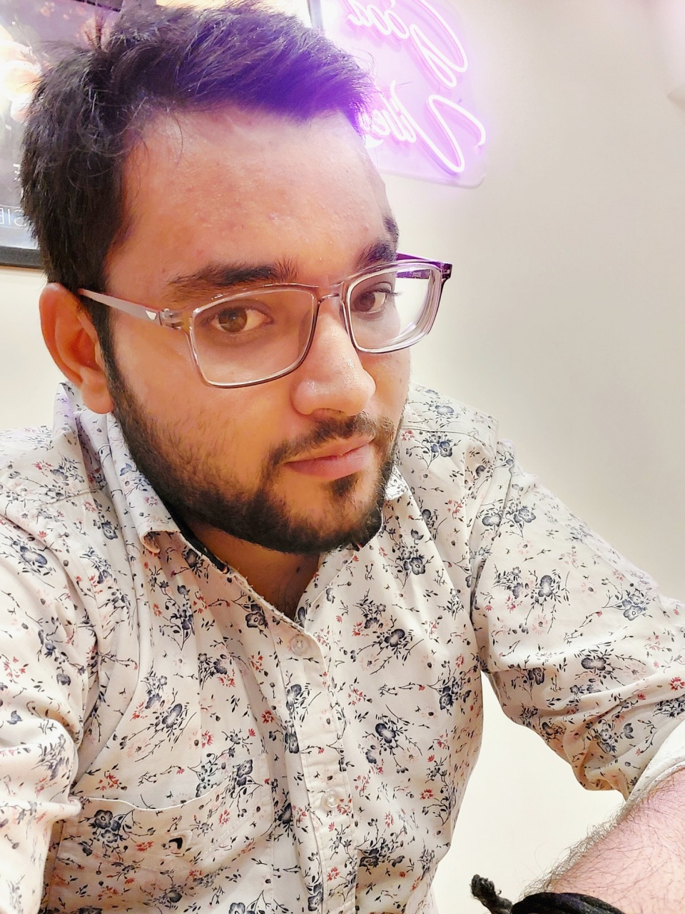
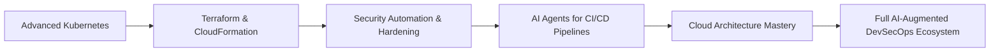

# 👋 Welcome to My AI-Ops Universe

## **Aaditya Acharya**

### 🔐 DevSecOps Engineer | 🚀 CI/CD Specialist | ☁️ Cloud Engineer | 🤖 AI Automation Innovator

---

## 🔐 About Me — *Where DevSecOps Meets AI*

I am a **DevSecOps Engineer** with deep experience in secure CI/CD pipelines, cloud infrastructure, automation, and **AI-powered engineering**. Working in a live **banking environment at TCS**, I design and implement secure, scalable and AI-augmented DevOps workflows.

My expertise blends **DevOps + Security + Cloud + AI** to solve modern engineering challenges.

### 💡 I Focus On:

* ✔️ Security-first CI/CD (SAST, DAST, Quality Gates)
* ✔️ Cloud-native deployment automation
* ✔️ Intelligent release validation (Python + AI)
* ✔️ Automated documentation & predictive monitoring
* ✔️ Container security & compliance (Docker/K8s)

> **“Automation builds efficiency. Security builds trust. AI builds intelligence.”**

---

## 🛡️ DevSecOps Skillset

### **Security Tools & Practices**

* 🔒 **SonarQube** – Code Quality & SAST
* 🛡️ **Fortify SCA** – Advanced static security scanning
* 🧪 **OWASP ZAP** – DAST and vulnerability testing
* 🐳 **Trivy / Snyk** – Container & dependency scanning
* 📜 Compliance reporting & pipeline security gates

### **DevOps & Cloud Platforms**

### **Languages & Scripting**

---

## 🤖 AI-Powered DevOps — My Passion

I strongly believe **AI is the next evolution of DevOps**. I integrate AI in real-world engineering to reduce human errors, accelerate delivery, and increase quality.

### 🌟 How I Use AI in DevOps:

* 🔍 AI-assisted code review & vulnerability detection
* 📊 Automated insights on SonarQube & Fortify reports
* 🧪 AI-generated test cases & scenario predictions
* 🚨 Predictive system monitoring (failure forecasting)
* 📝 AI-driven documentation & release summaries
* 🤖 Building intelligent DevOps agents for CI/CD decisions

### **AI Tools I Leverage:**

> **“AI won’t replace DevOps engineers — but DevOps engineers using AI will outperform the rest.”**

---

## 🏦 Banking DevSecOps Project — TCS

### **Core Responsibilities:**

* Implementing **automated CI/CD pipelines** for banking applications
* Integrating **SonarQube, Fortify with custom Python security**
* Automating deployment verification & environment readiness
* Reducing manual overhead with AI-driven workflow automation
* Managing cloud resources with Ansible & AWS
* Ensuring zero-downtime production deployments

### **Measured Impact:**

* ✔️ 99.9% successful CI/CD execution
* ✔️ 20% cloud cost optimization
* ✔️ 30% reduction in deployment issues
* ✔️ 50% faster release cycles via AI automation

---

## 🧠 Featured Projects

### **1️⃣ AI-Enhanced CI/CD Security Pipeline**

* Automated SAST + AI code review
* Generates security heatmaps for developers
* Ensures secure deployments by default

### **2️⃣ OpenCV-Based Eye State Detection (Award-Winning)**

* Real-time drowsiness detection (90%+ accuracy)
* Built using Python, OpenCV & ML
* Focused on reducing road accidents due to fatigue

### **3️⃣ Conversational AI Bot (Python NLP Project)**

* Context-aware reply generation
* Demonstrates early foundation in AI systems

---

## 🏅 Achievements

* 🏆 **TCS Constant Companion Award** – Outstanding dedication & project impact
* 🏆 **TCS AI Spark Award** – Innovative AI integration in banking workflows
* ⭐ **Two On-The-Spot Awards** – Rapid issue handling & continuous support
* 🎖️ **Service Commitment Award** – Strong multi-year contribution
* 🥇 **Best Presentation Award — OpenCV-Based Safety Project**
* 🎓 **Growth School AI Workshop Graduate** – 3-day AI accelerator

---

## 🎯 2025 DevSecOps + AI Roadmap 🚀

---

## 📊 GitHub Contributions

---

## 📫 Connect With Me

)

---

## 💬 Philosophy

> **“Optimization is not a task — it’s a mindset.”**
> **“Security is a culture — automation makes it scalable.”**
> **“The future of DevOps is AI-Augmented DevSecOps.”**

---

### ⭐ *Thank you for visiting my profile! Let's build secure, automated, intelligent systems together!* 🚀

